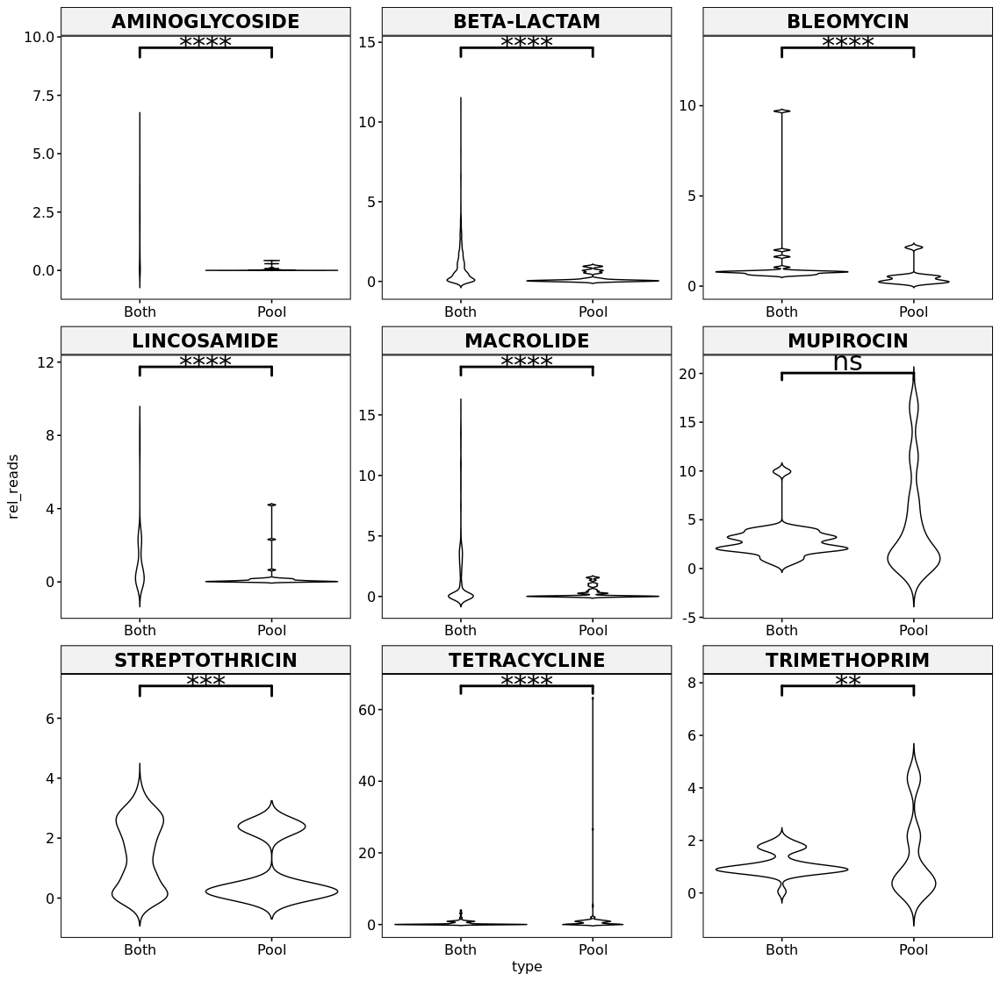

# GASP
R code for the Genomic Analysis of Singles and Pools (GASP) project. Raw data can be downloaded from <figshare link>

Comparison of genomic diversity between single and pooled Staphylococcus
aureus colonies isolated from human colonisation cultures
================
Vishnu Raghuram
03/18/2022

## Loading libraries

``` r
knitr::opts_chunk$set(cache = T)  

library(ggplot2)
library(ggtree)
library(ape)
library(ggpmisc)
library(scales)
library(ggpubr)
library(gridExtra)
library(dplyr)
library(plyr)
library(pheatmap)
library(RColorBrewer)
library(cowplot)
library(data.table)
library(tidyr)
library(ggridges)
library(stringr)
library(ggplotify)
library(ggside)
library(multcomp)
library(caret)
library(rstatix)

```

## Loading data tables

### Reading sample descriptions

``` r
semaphore_id_desc<-read.table("semaphore_id_desc.tab",header=T,sep="\t")
```

### Assembly quality

``` r
quals<-read.table(file="semaphore-report_quality_ST.tab",header=T,sep="\t")
quals<-merge(quals,semaphore_id_desc,by.x="sample",by.y="Sample_ID")
quals$mlst_ariba_st[quals$mlst_ariba_st == "Novel" | quals$mlst_ariba_st == "Novel*" | quals$mlst_ariba_st == "ND"] <- "Unknown"
quals$mlst_blast_st[quals$mlst_blast_st == "Novel" | quals$mlst_blast_st == "Novel*" | quals$mlst_blast_st == "ND"] <- "Unknown"


# Read quality
bactopia_report<-read.csv("bactopia_report_filtered_samples.tab",header=T,sep="\t")

#Compare read qual between pools and singles
t.test(bactopia_report$final_qual_mean[bactopia_report$Sweep=="Single"],bactopia_report$final_qual_mean[bactopia_report$Sweep=="Pooled"])
```

    ## 
    ##  Welch Two Sample t-test
    ## 
    ## data:  bactopia_report$final_qual_mean[bactopia_report$Sweep == "Single"] and bactopia_report$final_qual_mean[bactopia_report$Sweep == "Pooled"]
    ## t = 0.4883, df = 316.02, p-value = 0.6257
    ## alternative hypothesis: true difference in means is not equal to 0
    ## 95 percent confidence interval:
    ##  -0.02673655  0.04438872
    ## sample estimates:
    ## mean of x mean of y 
    ##  36.32047  36.31164

### SNP Distances

``` r
# Per participant SNP distances across all samples
snp_dists_all_patients<-read.table("ALL_snp_dists_per_patient.tab",header=F,sep="\t")
colnames(snp_dists_all_patients)<-c("Sample_ID_1","Sample_ID_2","SNPs")
snp_dists_all_patients<-merge(snp_dists_all_patients,semaphore_id_desc[,c(1,2,3,4)],by.x="Sample_ID_1",by.y="Sample_ID")
snp_dists_all_patients<-merge(snp_dists_all_patients,semaphore_id_desc[,c(1,2,3,4)],by.x="Sample_ID_2",by.y="Sample_ID")

colnames(snp_dists_all_patients)<-c("Sample_ID_1","Sample_ID_2","SNPs","Patient_ID_1","Time_1","Site_1","Patient_ID_2","Time_2","Site_2")

# Keep only within participant comparisons
snp_dists_all_patients<-snp_dists_all_patients[snp_dists_all_patients$Sample_ID_1!=snp_dists_all_patients$Sample_ID_2 & snp_dists_all_patients$Patient_ID_1==snp_dists_all_patients$Patient_ID_2,]

# Annotate which comparisons are same site/same time/both/neither
snp_dists_all_patients$Concordance<-ifelse(snp_dists_all_patients$Site_1==snp_dists_all_patients$Site_2 & snp_dists_all_patients$Time_1==snp_dists_all_patients$Time_2,"Same site & Same time",ifelse(snp_dists_all_patients$Site_1==snp_dists_all_patients$Site_2 & snp_dists_all_patients$Time_1!=snp_dists_all_patients$Time_2,"Same site & Diff time", ifelse(snp_dists_all_patients$Site_1!=snp_dists_all_patients$Site_2 & snp_dists_all_patients$Time_1==snp_dists_all_patients$Time_2,"Diff site & Same time",ifelse(snp_dists_all_patients$Site_1!=snp_dists_all_patients$Site_2 & snp_dists_all_patients$Time_1!=snp_dists_all_patients$Time_2,"Diff site & Diff time","NA"))))

#Keep only singles in SNP dists from the filtered set:
bb<-merge(snp_dists_all_patients,semaphore_id_desc[semaphore_id_desc$Sweep=="Single",c(1,9)],by.x="Sample_ID_1",by.y="Sample_ID")
bb<-merge(bb,semaphore_id_desc[semaphore_id_desc$Sweep=="Single",c(1,9)],by.x="Sample_ID_2",by.y="Sample_ID")

snp_dists_all_patients<-bb
remove(bb)
```

### ST types

``` r
mlst<-read.table("final_filtered_semaphore_2023_mlst.tab",header=T,sep="\t")

mlst$alleles<-paste(mlst$arcC,mlst$aroE,mlst$glpF,mlst$gmk,mlst$pta,mlst$tpi,mlst$yqiL,sep="_")

mlst<-merge(mlst[,c(1,3,11)],semaphore_id_desc,by="Sample_ID")

mlst$multi_allele <- ifelse(grepl(",", mlst$alleles), "yes", "no")

# Check if all singles have single MLST alleles (yes they do)
table(mlst[,c(10,12)])
```

    ##         multi_allele
    ## Sweep      no  yes
    ##   Pooled  239   15
    ##   Single 2032    0

``` r
# Get pool_IDs with multiple STs
multi_st_Pool_IDs<-count(count(mlst[,c(3,11)])$Pool_ID)$x[count(count(mlst[,c(3,11)])$Pool_ID)$freq>1]
table(count(count(mlst[,c(3,11)])$Pool_ID)$freq)
```

    ## 
    ##   1   2   3 
    ## 209  39   6

``` r
mlst$mixed_allele[!mlst$Pool_ID %in% multi_st_Pool_IDs]<-"no"
mlst$mixed_allele[mlst$Pool_ID %in% multi_st_Pool_IDs]<-"yes"

mlst$ST[mlst$ST=="-"]<-"Unknown"

#semaphore_id_desc<-merge(semaphore_id_desc,mlst[,c(1,12)],by="Sample_ID")
quals<-merge(quals,mlst[,c(1,13)],by.y="Sample_ID",by.x="sample")
```

### Get random list of singles

``` r
# What if we had sampled only four singles? Or two singles? or only one single? 
# Randomly select 4, 2 or 1 single per pool ID

four_rand<-semaphore_id_desc[semaphore_id_desc$Sweep=="Single",c(1,9)] %>% group_by(Pool_ID) %>% sample_n(size = 4)

two_rand<-semaphore_id_desc[semaphore_id_desc$Sweep=="Single",c(1,9)] %>% group_by(Pool_ID) %>% sample_n(size = 2)

one_rand<-semaphore_id_desc[semaphore_id_desc$Sweep=="Single",c(1,9)] %>% group_by(Pool_ID) %>% sample_n(size = 1)
```

### Allele frequency data

#### Singles

``` r
# All variants from snippy bam file. Filter by total read depth > 25 and mapping qual > 50
# Get only variants fixed in singles ( alt_AF > 0.95)

mpileup_MAF_singles_table<-read.table("singles_aligned_to_pool_snippy_vars_reformatted.tab",header=F,sep="\t",col.names=c("Sample_ID","ref_chr","Pos","ref","alt","Qual","DP","ref_fwd","ref_rev","alt_fwd","alt_rev","ref_AF","alt_AF","MAF"))
mpileup_MAF_singles_table<-merge(mpileup_MAF_singles_table,semaphore_id_desc,by="Sample_ID")
mpileup_MAF_singles_table<-mpileup_MAF_singles_table[(mpileup_MAF_singles_table$ref_fwd+mpileup_MAF_singles_table$ref_rev>25 | mpileup_MAF_singles_table$alt_fwd+mpileup_MAF_singles_table$alt_rev>25) & mpileup_MAF_singles_table$Qual>50 & mpileup_MAF_singles_table$alt_AF>0.05,]

# same site has two different variants annotated, it is still considered a variant in that one site so they can be consolidated 

# Change AFs to no. of singles a variant is present in. For eg if variant is present in 4 out of 8, AF is 0.5

# This gives us the "expected" allele frequency - Assuming the eight singles are all that are there in the true pool, and assuming they are there in equal proportions, what would their AF be? 
# This assumption can then be tested by comparing the expected and true pools

mpileup_expected_AF<-unique(mpileup_MAF_singles_table[mpileup_MAF_singles_table$alt_AF>0.95,c(1,3,22)]) %>% count(c("Pool_ID", "Pos"))
mpileup_expected_AF$expected_allele_freq<-mpileup_expected_AF$freq/8


# Next, we calculate downsampled AFs - assuming we sampled only four singles instead of eight, what would the AFs be? Would we still be seeing all the variants we saw if we had sampled eight? What if we sampled only two singles? What if we sampled only one? 

# Get four random sample_IDs for singles and calculate AFs

mpileup_four_AF<-unique(merge(mpileup_MAF_singles_table[mpileup_MAF_singles_table$alt_AF>0.95,c(1,3,22)],four_rand,by=c("Sample_ID","Pool_ID"))) %>% count(c("Pool_ID", "Pos"))
mpileup_four_AF$four_allele_freq<-mpileup_four_AF$freq/4


# Two random sample_IDs

mpileup_two_AF<-unique(merge(mpileup_MAF_singles_table[mpileup_MAF_singles_table$alt_AF>0.95,c(1,3,22)],two_rand,by=c("Sample_ID","Pool_ID"))) %>% count(c("Pool_ID", "Pos"))
mpileup_two_AF$two_allele_freq<-mpileup_two_AF$freq/2

# One random sample_ID

mpileup_one_AF<-unique(merge(mpileup_MAF_singles_table[mpileup_MAF_singles_table$alt_AF>0.95,c(1,3,22)],one_rand,by=c("Sample_ID","Pool_ID"))) %>% count(c("Pool_ID", "Pos"))
mpileup_one_AF$one_allele_freq<-mpileup_one_AF$freq

# Merge all tables

mpileup_expected_AF<-merge(mpileup_expected_AF[,c(1,2,4)],mpileup_four_AF[,c(1,2,4)],by=c("Pool_ID","Pos"),all.x=T)
mpileup_expected_AF<-merge(mpileup_expected_AF,mpileup_two_AF[,c(1,2,4)],by=c("Pool_ID","Pos"),all.x=T)
mpileup_expected_AF<-merge(mpileup_expected_AF,mpileup_one_AF[,c(1,2,4)],by=c("Pool_ID","Pos"),all.x=T)

# Fill missing AFs with 0

mpileup_expected_AF[is.na(mpileup_expected_AF)] <- 0

# Remove intermediate tables

remove(mpileup_four_AF,mpileup_two_AF,mpileup_one_AF)
```

#### Pools

``` r
# Get all variants from all samples and filter out pools

mpileup_MAF_table<-read.table("ALL_autoref_mpileup_reformatted_vcf.tab",header=F,sep="\t",col.names = c("Sample_ID","Ref_acc","Pos","Ref","Alt","Qual","DP","ref_fwd","ref_rev","alt_fwd","alt_rev","total_ref","total_alt","actual_MAF") )

mpileup_MAF_table<-merge(mpileup_MAF_table,semaphore_id_desc,by="Sample_ID")
mpileup_MAF_table$Time<-factor(mpileup_MAF_table$Time, levels=c("En","3M","6M","9M","12M"))

# Variants in pools with map qual 50 and read depth > 25 (same as singles)
mpileup_MAF_pooled_table<-mpileup_MAF_table[mpileup_MAF_table$Sweep=="Pooled" & (mpileup_MAF_table$ref_fwd+mpileup_MAF_table$ref_rev>25 | mpileup_MAF_table$alt_fwd+mpileup_MAF_table$alt_rev>25) & mpileup_MAF_table$Qual>50,]

remove(mpileup_MAF_table)

# Calculate alternate allele freq for pools (consider only sits with AF > 0.05)

mpileup_MAF_pooled_table$actual_alt_AF<-(mpileup_MAF_pooled_table$alt_fwd+mpileup_MAF_pooled_table$alt_rev)/(mpileup_MAF_pooled_table$alt_fwd+mpileup_MAF_pooled_table$alt_rev+mpileup_MAF_pooled_table$ref_fwd+mpileup_MAF_pooled_table$ref_rev)
mpileup_MAF_pooled_table<-mpileup_MAF_pooled_table[mpileup_MAF_pooled_table$actual_alt_AF>0.05,]
```

#### Combining pool variants and single variants

``` r
# Compare expected pool AFs, downsampled pool AFs and true pool AFs for all variants

mpileup_expected_AF<-merge(mpileup_expected_AF,mpileup_MAF_pooled_table[,c(22,3,14,23)],by=c("Pool_ID","Pos"),all=T)
mpileup_expected_AF[is.na(mpileup_expected_AF)] <- 0
mpileup_expected_AF[c('Patient_ID', 'Time','Site')] <- str_split_fixed(mpileup_expected_AF$Pool_ID, '_', 3)
```

#### Percentage shared vs unshared

``` r
# total
shared_v_unshared<-as.data.frame(table(mpileup_expected_AF$Pool_ID))
colnames(shared_v_unshared)<-c("Var1","total")

# only pools
shared_v_unshared<-(merge(as.data.frame(table(mpileup_expected_AF$Pool_ID[mpileup_expected_AF$actual_alt_AF>0.05 & (mpileup_expected_AF$expected_allele_freq==0)])),shared_v_unshared,by="Var1",all=T))
colnames(shared_v_unshared)<-c("Var1","only_pool","total")

# only singles
shared_v_unshared<-(merge(as.data.frame(table(mpileup_expected_AF$Pool_ID[mpileup_expected_AF$actual_alt_AF==0 & mpileup_expected_AF$expected_allele_freq>0.5])),shared_v_unshared,by="Var1",all=T))
colnames(shared_v_unshared)<-c("Var1","only_singles","only_pool","total")

# Pools
shared_v_unshared<-(merge(as.data.frame(table(mpileup_expected_AF$Pool_ID[mpileup_expected_AF$actual_alt_AF>0])),shared_v_unshared,by="Var1",all=T))
colnames(shared_v_unshared)<-c("Var1","Pools","only_singles","only_pool","total")

# Singles
shared_v_unshared<-(merge(as.data.frame(table(mpileup_expected_AF$Pool_ID[mpileup_expected_AF$expected_allele_freq>0])),shared_v_unshared,by="Var1",all=T))
colnames(shared_v_unshared)<-c("Var1","Singles","Pools","only_singles","only_pool","total")

# Pools AND singles (fixed in both)
shared_v_unshared<-(merge(as.data.frame(table(mpileup_expected_AF$Pool_ID[mpileup_expected_AF$actual_alt_AF>0.95 & (mpileup_expected_AF$expected_allele_freq>0.95)])),shared_v_unshared,by="Var1",all=T))
colnames(shared_v_unshared)<-c("Var1","pools_and_singles_fixed","Singles","Pools","only_singles","only_pool","total")

# Pools AND singles (all)
shared_v_unshared<-(merge(as.data.frame(table(mpileup_expected_AF$Pool_ID[mpileup_expected_AF$actual_alt_AF>0.05 & (mpileup_expected_AF$expected_allele_freq>0.05)])),shared_v_unshared,by="Var1",all=T))
colnames(shared_v_unshared)<-c("Var1","pools_and_singles_all","pools_and_singles_fixed","Singles","Pools","only_singles","only_pool","total")

# four
shared_v_unshared<-(merge(as.data.frame(table(mpileup_expected_AF$Pool_ID[mpileup_expected_AF$four_allele_freq>0])),shared_v_unshared,by="Var1",all=T))

colnames(shared_v_unshared)<-c("Var1","four","pools_and_singles_all","pools_and_singles_fixed","Singles","Pools","only_singles","only_pool","total")

# two
shared_v_unshared<-(merge(as.data.frame(table(mpileup_expected_AF$Pool_ID[mpileup_expected_AF$two_allele_freq>0])),shared_v_unshared,by="Var1",all=T))

colnames(shared_v_unshared)<-c("Var1","two","four","pools_and_singles_all","pools_and_singles_fixed","Singles","Pools","only_singles","only_pool","total")

# one
shared_v_unshared<-(merge(as.data.frame(table(mpileup_expected_AF$Pool_ID[mpileup_expected_AF$one_allele_freq>0])),shared_v_unshared,by="Var1",all=T))

colnames(shared_v_unshared)<-c("Pool_ID","one","two","four","pools_and_singles_all","pools_and_singles_fixed","Singles","Pools","only_singles","only_pool","total")

# Segregating sites : Variant sites that show populations segregating from within the clones and/or pools. These are not all variant sites, we should exclude variants that are simply because of comparing with a specific reference

# If a variant is fixed in the pools AND fixed in the singles ( > 0.9 AF or present in 8 out of 8 singles all at > 0.9 AF ) AND if the pools and corresponding singles are compared to the same reference (we know this is true) AND if the pools and singles are the same ST (multi_st_Pool_IDs and mismatched_pools_singles will filter our samples that aren't) --> that site is NOT a segregating site

# To calculate this, first get # of sites that are fixed in both singles and pools
# Then get # of all sites in singles. All sites in singles minus sites fixed in both singles and pools = expected # of segregating sites in singles 
# # of all sites in Pools minus sites fixed in both pools and singles = actual no. of segregating sites in pools

# Expected segregating sites

shared_v_unshared$expected_seg_sites<-shared_v_unshared$Singles - shared_v_unshared$pools_and_singles_fixed

#shared_v_unshared<-(merge(as.data.frame(table(mpileup_expected_AF$Pool_ID[!(mpileup_expected_AF$expected_allele_freq!=1 & mpileup_expected_AF$actual_alt_AF!=1) & mpileup_expected_AF$expected_allele_freq>0.1])),shared_v_unshared,by="Var1",all=T))

#colnames(shared_v_unshared)<-c("Var1","expected_seg_sites","one","two","four","pools_and_singles","Singles","Pools","only_singles","only_pool","total")

# Actual segregating sites

shared_v_unshared$actual_seg_sites<-shared_v_unshared$Pools - shared_v_unshared$pools_and_singles_fixed

#shared_v_unshared<-(merge(as.data.frame(table(mpileup_expected_AF$Pool_ID[!(mpileup_expected_AF$expected_allele_freq>0.9 & mpileup_expected_AF$actual_alt_AF>0.9) & mpileup_expected_AF$actual_MAF>0.1])),shared_v_unshared,by="Var1",all=T))

#colnames(shared_v_unshared)<-c("Pool_ID","actual_seg_sites","expected_seg_sites","one","two","four","pools_and_singles","Singles","Pools","only_singles","only_pool","total")


shared_v_unshared[is.na(shared_v_unshared)]<-0

shared_v_unshared<-(merge(shared_v_unshared,mlst[mlst$Sweep=="Pooled",c(11,13)],by="Pool_ID"))

mismatched_pools_singles_Pool_IDs<-shared_v_unshared$Pool_ID[shared_v_unshared$pools_and_singles_all/shared_v_unshared$total<0.05]
```

#### Randomly combining pool and expected pool for null model

``` r
x<-vector()
for (i in seq(1,5))
{
random_mpileup_expected_AF<-unique(mpileup_MAF_singles_table[mpileup_MAF_singles_table$alt_AF>0.95,c(1,3,22)]) %>% count(c("Pool_ID", "Pos"))
random_mpileup_expected_AF$rand_expected_allele_freq<-random_mpileup_expected_AF$freq/8
random_mpileup_expected_AF <- transform( random_mpileup_expected_AF, Pool_ID = sample(Pool_ID) )

random_mpileup_expected_AF<-merge(random_mpileup_expected_AF,mpileup_MAF_pooled_table[,c(22,3,14,23)],by=c("Pool_ID","Pos"),all=T)
random_mpileup_expected_AF[is.na(random_mpileup_expected_AF)] <- 0


rand_shared_v_unshared<-as.data.frame(table(random_mpileup_expected_AF$Pool_ID))
colnames(rand_shared_v_unshared)<-c("Var1","total")

rand_shared_v_unshared<-(merge(as.data.frame(table(random_mpileup_expected_AF$Pool_ID[random_mpileup_expected_AF$actual_alt_AF>0 & (random_mpileup_expected_AF$rand_expected_allele_freq>0)])),rand_shared_v_unshared,by="Var1",all=T))

colnames(rand_shared_v_unshared)<-c("Pool_ID","pools_and_rand_expected","total")
rand_shared_v_unshared[is.na(rand_shared_v_unshared)] <- 0

x<-append(x,max(rand_shared_v_unshared$pools_and_rand_expected/rand_shared_v_unshared$total))

}

x
```

    ## [1] 0.05043948 0.04910464 0.04995461 0.04991729 0.04883516

``` r
remove(x)
```

#### Calculate average MAF in pools and expected pools

``` r
# Calculate minor allele freq for expected pools
mpileup_expected_AF$expected_MAF<-ifelse(mpileup_expected_AF$expected_allele_freq>0.5,(1-mpileup_expected_AF$expected_allele_freq),mpileup_expected_AF$expected_allele_freq)

# Calculate expected average MAF  
mean_MAF_singles<-setDT(mpileup_expected_AF[mpileup_expected_AF$expected_allele_freq>0,])[, .(MAF_sum=sum(expected_MAF),snp_freq = .N), by=.(Pool_ID)]
mean_MAF_singles$expected_mean_MAF<-mean_MAF_singles$MAF_sum/mean_MAF_singles$snp_freq

shared_v_unshared<-merge(shared_v_unshared,mean_MAF_singles[,c(1,4)],by="Pool_ID")

remove(mean_MAF_singles)

# Calculate actual average MAF
mean_MAF_pools<-setDT(mpileup_expected_AF[mpileup_expected_AF$actual_alt_AF>0,])[, .(MAF_sum=sum(actual_MAF),snp_freq = .N), by=.(Pool_ID)]
mean_MAF_pools$actual_mean_MAF<-mean_MAF_pools$MAF_sum/mean_MAF_pools$snp_freq

shared_v_unshared<-merge(shared_v_unshared,mean_MAF_pools[,c(1,4)],by="Pool_ID")

remove(mean_MAF_pools)

# Calculate average MAF for true singles
mean_MAF_true_singles<-setDT(mpileup_MAF_singles_table)[, .(MAF_sum=sum(MAF),snp_freq = .N), by=.(Sample_ID)]

mean_MAF_true_singles$true_singles_mean_MAF<-mean_MAF_true_singles$MAF_sum/mean_MAF_true_singles$snp_freq
```

#### Number of new variants per single added

##### Number of new variants after one single

``` r
x<-count(mpileup_expected_AF$Pool_ID[mpileup_expected_AF$actual_alt_AF>0])
colnames(x)<-c("Pool_ID","Pools")
y<-count(mpileup_expected_AF$Pool_ID[mpileup_expected_AF$one_allele_freq>0])
z<-merge(x,y,by.x="Pool_ID",by.y="x",all.x=T)
z[is.na(z)] <- 0
z$`One`<-z$Pools+z$freq

econ_vars_one<-z[,c(1,2,4)]

remove(y,z)
y<-count(mpileup_expected_AF$Pool_ID[mpileup_expected_AF$one_allele_freq==0 & mpileup_expected_AF$two_allele_freq>0])
z<-merge(x,y,by.x="Pool_ID",by.y="x",all.x=T)
z[is.na(z)] <- 0
z$`Two`<-z$Pools+z$freq

econ_vars_one<-merge(econ_vars_one,z[,c(1,4)],by.x="Pool_ID")

remove(y,z)
y<-count(mpileup_expected_AF$Pool_ID[mpileup_expected_AF$one_allele_freq==0 &  mpileup_expected_AF$four_allele_freq>0])
z<-merge(x,y,by.x="Pool_ID",by.y="x",all.x=T)
z[is.na(z)] <- 0
z$`Four`<-z$Pools+z$freq

econ_vars_one<-merge(econ_vars_one,z[,c(1,4)],by.x="Pool_ID")

remove(y,z)
y<-count(mpileup_expected_AF$Pool_ID[mpileup_expected_AF$one_allele_freq==0 &  mpileup_expected_AF$expected_allele_freq>0])
z<-merge(x,y,by.x="Pool_ID",by.y="x",all.x=T)
z[is.na(z)] <- 0
z$`Eight`<-z$Pools+z$freq

econ_vars_one<-merge(econ_vars_one,z[,c(1,4)],by.x="Pool_ID")

econ_vars_one[3:ncol(econ_vars_one)]<-econ_vars_one[3:ncol(econ_vars_one)]-econ_vars_one[,2]

econ_vars_one<-pivot_longer(econ_vars_one,names_to = "add",values_to = "new_vars",cols = c(2,3,4,5,6))

remove(x,y,z)
```

##### Number of new variants from singles after pool

``` r
x<-count(mpileup_expected_AF$Pool_ID[mpileup_expected_AF$actual_alt_AF>0])
colnames(x)<-c("Pool_ID","Pools")

y<-count(mpileup_expected_AF$Pool_ID[mpileup_expected_AF$actual_alt_AF==0 & mpileup_expected_AF$one_allele_freq>0])
z<-merge(x,y,by.x="Pool_ID",by.y="x",all.x=T)
z[is.na(z)] <- 0
z$`Two`<-z$Pools+z$freq

econ_vars_pool<-z[,c(1,2,4)]

remove(y,z)
y<-count(mpileup_expected_AF$Pool_ID[mpileup_expected_AF$actual_alt_AF==0 &  mpileup_expected_AF$two_allele_freq>0])
z<-merge(x,y,by.x="Pool_ID",by.y="x",all.x=T)
z[is.na(z)] <- 0
z$`Three`<-z$Pools+z$freq

econ_vars_pool<-merge(econ_vars_pool,z[,c(1,4)],by.x="Pool_ID")

remove(y,z)
y<-count(mpileup_expected_AF$Pool_ID[mpileup_expected_AF$actual_alt_AF==0 &  mpileup_expected_AF$four_allele_freq>0])
z<-merge(x,y,by.x="Pool_ID",by.y="x",all.x=T)
z[is.na(z)] <- 0
z$`Five`<-z$Pools+z$freq

econ_vars_pool<-merge(econ_vars_pool,z[,c(1,4)],by.x="Pool_ID")

remove(y,z)
y<-count(mpileup_expected_AF$Pool_ID[mpileup_expected_AF$actual_alt_AF==0 &  mpileup_expected_AF$expected_allele_freq>0])
z<-merge(x,y,by.x="Pool_ID",by.y="x",all.x=T)
z[is.na(z)] <- 0
z$`Nine`<-z$Pools+z$freq

econ_vars_pool<-merge(econ_vars_pool,z[,c(1,4)],by.x="Pool_ID")

econ_vars_pool[3:ncol(econ_vars_pool)]<-econ_vars_pool[3:ncol(econ_vars_pool)]-econ_vars_pool[,2]

econ_vars_pool<-pivot_longer(econ_vars_pool,names_to = "add",values_to = "new_vars",cols = c(2,3,4,5,6))
econ_vars_pool$add[econ_vars_pool$add=="Pools"]<-"One"

remove(x,y,z)
```

### InStrain data

``` r
instrain<-read.table("instrain_genome_info.tab",header=F,sep="\t",col.names=c("Sample_ID","Pool_type","genome","coverage","breadth","nucl_diversity","length","true_scaffolds","detected_scaffolds","coverage_median","coverage_std","coverage_SEM","breadth_minCov","breadth_expected","nucl_diversity_rarefied","conANI_reference","popANI_reference","iRep","iRep_GC_corrected","linked_SNV_count","SNV_distance_mean","r2_mean","d_prime_mean","consensus_divergent_sites","population_divergent_sites","SNS_count","SNV_count","filtered_read_pair_count","reads_unfiltered_pairs","reads_mean_PID","reads_unfiltered_reads","divergent_site_count"))

instrain<-merge(instrain,semaphore_id_desc,by="Sample_ID")

instrain$Pool_type[instrain$Pool_type=="actual"]<-"pool"
instrain$Pool_type[instrain$Pool_type=="expected"]<-"eight"

instrain$Pool_type<-factor(instrain$Pool_type, levels=c("pool","eight","four","two","single"))

instrain<-merge(instrain,mlst[,c(1,13)],by="Sample_ID")
```

### AMR classes

#### Number of AMR classes detected per sample

``` r
amr_report<-read.csv("downsampled_amr_gene_report.tab",header=F, sep="\t",col.names=c("Sample_ID","Gene symbol","Sequence name","Scope","Class","Sweep"))
amr_report<-amr_report[amr_report$Sweep=="one" | amr_report$Sweep=="pool",c(1,2,3,5)]

# tet(38) is overcalled - found in almost every sample. remove.
amr_report<-amr_report[amr_report$Gene.symbol != "tet(38)",]

# Get no. of genes per class for all samples including samples with no amr gene called at all
amr_report<-merge(amr_report,semaphore_id_desc,by="Sample_ID",all.y=T)
amr_report$Class[is.na(amr_report$Class)]<-"Dummy"

# Get no. of amr genes per class for pools
amr_counts_pool<-as.data.frame(table(amr_report[amr_report$Sweep=="Pooled",c("Pool_ID","Class")]))
colnames(amr_counts_pool)<-c("Pool_ID","Class","Pool_freq")

# Calculate no. of genes per classes if all 8 singles are sampled
x<-as.data.frame(table(amr_report[amr_report$Sweep=="Single",c("Pool_ID","Class")]))
colnames(x)<-c("Pool_ID","Class","eight_freq")
amr_counts_pool<-merge(amr_counts_pool,x,by=c("Pool_ID","Class"),all=T)

# Calculate no. of genes per classes if only four random singles are sampled
x<-merge(amr_report,four_rand,by=c("Sample_ID","Pool_ID"))
x<-as.data.frame(table(x[,c("Pool_ID","Class")]))
colnames(x)<-c("Pool_ID","Class","four_freq")
amr_counts_pool<-merge(amr_counts_pool,x,by=c("Pool_ID","Class"),all=T)

# Calculate no. of genes per classes if only two random singles are sampled
x<-merge(amr_report,two_rand,by=c("Sample_ID","Pool_ID"))
x<-as.data.frame(table(x[,c("Pool_ID","Class")]))
colnames(x)<-c("Pool_ID","Class","two_freq")
amr_counts_pool<-merge(amr_counts_pool,x,by=c("Pool_ID","Class"),all=T)

# Calculate no. of genes per classes if only one random single is sampled
x<-merge(amr_report,one_rand,by=c("Sample_ID","Pool_ID"))
x<-as.data.frame(table(x[,c("Pool_ID","Class")]))
colnames(x)<-c("Pool_ID","Class","one_freq")
amr_counts_pool<-merge(amr_counts_pool,x,by=c("Pool_ID","Class"),all=T)

# Convert NAs to 0
amr_counts_pool[is.na(amr_counts_pool)]<-0

# Convert to presence absence (if class is present, 1 else 0)
amr_counts_pool <- mutate_if(amr_counts_pool,is.numeric, ~1 * (. > 0))

x<-amr_counts_pool #for use in next section

amr_counts_pool<-pivot_longer(amr_counts_pool,names_to = "freq_sample",values_to = "freq",cols = 3:7)

amr_counts_pool<-amr_counts_pool[amr_counts_pool$freq>0,]

classes_per_sample<-count(amr_counts_pool[,c(1,3)])
classes_per_sample$freq_sample<-factor(classes_per_sample$freq_sample, levels=c("one_freq","two_freq","four_freq","eight_freq","Pool_freq"))
```

#### AMR gene abundance in pools and singles

``` r
rpod_quant<-read.table("salmon_rpod.tab",header=F,col.names=c("Sample_ID","gene","len","efflen","TPM_rpod","no_rpod_reads"),sep="\t")
rpod_quant<-rpod_quant[rpod_quant$TPM_rpod>1,]

rpod_quant$norm_rpoD_reads<-(1000*rpod_quant$no_rpod_reads)/rpod_quant$len

amr_quant<-read.csv("tmp_amrfinder.tab",header=F,col.names=c("Sample_ID","gene","len","efflen","TPM_amr","no_amr_reads"),sep="\t")
amr_quant<-amr_quant[amr_quant$TPM_amr>1,]
amr_quant$norm_amr_reads<-(1000*amr_quant$no_amr_reads)/amr_quant$len

amr_families<-read.csv("filtered_amrfinder_db_families.tab",header=F,sep="\t",col.names=c("gene_symbol","type","subtype","class","subclass","family_name"))

amr_families<-unique(amr_families[,c(1,4,5)])

amr_quant<-merge(amr_quant,amr_families,by.x="gene",by.y="gene_symbol")

amr_quant<-merge(amr_quant,semaphore_id_desc,by="Sample_ID")

amr_quant<-merge(amr_quant,rpod_quant[,c(1,7)],by="Sample_ID")

amr_quant$rel_reads<-amr_quant$norm_amr_reads/amr_quant$norm_rpoD_reads

amr_quant$class[amr_quant$class=="LINCOSAMIDE/STREPTOGRAMIN"]<-"STREPTOGRAMIN"
```

#### Abundances of AMR genes

``` r
pres_in_pool_abs_in_singles<-x[x$Pool_freq>0 & x$eight_freq==0,]
pres_in_both<-x[x$Pool_freq>0 & x$eight_freq>0,]
pres_in_both<-merge(pres_in_both,amr_quant,by.x=c("Pool_ID","Class"),by.y=c("Pool_ID","class"))
pres_in_pool_abs_in_singles<-merge(pres_in_pool_abs_in_singles,amr_quant,by.x=c("Pool_ID","Class"),by.y=c("Pool_ID","class"))

bb<-merge(pres_in_both[pres_in_both$Sweep=="Pooled",c(2,9,24)],pres_in_pool_abs_in_singles[pres_in_pool_abs_in_singles$Sweep=="Pooled",c(2,9,24)],by=c("Class","gene"))
colnames(bb)<-c("Class","gene","Both","Pool")

abund_comparison<-pivot_longer(bb,names_to = "type",values_to = "rel_reads",cols=c(3,4))
```

#### Number of new AMR classes per single added

##### Number of new AMR classes after one single

``` r
econ_amr_one<-count(x$Pool_ID[x$Pool_freq>0])
colnames(econ_amr_one)<-c("Pool_ID","Pools")

y<-count(x$Pool_ID[x$one_freq>0])
econ_amr_one<-merge(econ_amr_one,y,by.x="Pool_ID",by.y="x",all.x=T)
econ_amr_one[is.na(econ_amr_one)] <- 0
colnames(econ_amr_one)[colnames(econ_amr_one) == 'freq'] <- 'One'
remove(y)

y<-count(x$Pool_ID[x$one_freq==0 & x$two_freq>0])
econ_amr_one<-merge(econ_amr_one,y,by.x="Pool_ID",by.y="x",all.x=T)
econ_amr_one[is.na(econ_amr_one)] <- 0
colnames(econ_amr_one)[colnames(econ_amr_one) == 'freq'] <- 'Two'
remove(y)

y<-count(x$Pool_ID[x$one_freq==0 & x$four_freq>0])
econ_amr_one<-merge(econ_amr_one,y,by.x="Pool_ID",by.y="x",all.x=T)
econ_amr_one[is.na(econ_amr_one)] <- 0
colnames(econ_amr_one)[colnames(econ_amr_one) == 'freq'] <- 'Four'
remove(y)

y<-count(x$Pool_ID[x$one_freq==0 & x$eight_freq>0])
econ_amr_one<-merge(econ_amr_one,y,by.x="Pool_ID",by.y="x",all.x=T)
econ_amr_one[is.na(econ_amr_one)] <- 0
colnames(econ_amr_one)[colnames(econ_amr_one) == 'freq'] <- 'Eight'
remove(y)

econ_amr_one<-pivot_longer(econ_amr_one,names_to = "add",values_to = "new_vars",cols = c(2,3,4,5,6))
```

##### Number of new AMR classes after Pool

``` r
econ_amr_pool<-count(x$Pool_ID[x$Pool_freq>0])
colnames(econ_amr_pool)<-c("Pool_ID","One")

y<-count(x$Pool_ID[x$Pool_freq==0 & x$one_freq>0])
econ_amr_pool<-merge(econ_amr_pool,y,by.x="Pool_ID",by.y="x",all.x=T)
econ_amr_pool[is.na(econ_amr_pool)] <- 0
colnames(econ_amr_pool)[colnames(econ_amr_pool) == 'freq'] <- 'Two'
remove(y)

y<-count(x$Pool_ID[x$Pool_freq==0 &  x$two_freq>0])
econ_amr_pool<-merge(econ_amr_pool,y,by.x="Pool_ID",by.y="x",all.x=T)
econ_amr_pool[is.na(econ_amr_pool)] <- 0
colnames(econ_amr_pool)[colnames(econ_amr_pool) == 'freq'] <- 'Three'
remove(y)

y<-count(x$Pool_ID[x$Pool_freq==0 & x$four_freq>0])
econ_amr_pool<-merge(econ_amr_pool,y,by.x="Pool_ID",by.y="x",all.x=T)
econ_amr_pool[is.na(econ_amr_pool)] <- 0
colnames(econ_amr_pool)[colnames(econ_amr_pool) == 'freq'] <- 'Five'
remove(y)

y<-count(x$Pool_ID[x$Pool_freq==0 & x$eight_freq>0])
econ_amr_pool<-merge(econ_amr_pool,y,by.x="Pool_ID",by.y="x",all.x=T)
econ_amr_pool[is.na(econ_amr_pool)] <- 0
colnames(econ_amr_pool)[colnames(econ_amr_pool) == 'freq'] <- 'Nine'
remove(y)

econ_amr_pool<-pivot_longer(econ_amr_pool,names_to = "add",values_to = "new_vars",cols = c(2,3,4,5,6))
```

# FIGURES

## Part I - Variation in individual colonies

### Fig2A - SNP distances

``` r
#Per participant SNP distnace range
Fig2A<-ggplot(data=snp_dists_all_patients[snp_dists_all_patients$Concordance=="Same site & Same time" & snp_dists_all_patients$SNPs>0,],aes(y=reorder(Pool_ID.x,SNPs,FUN=mean),x=SNPs))+
  geom_boxplot(outlier.alpha = 1,color="black",fill="grey",outlier.size = 0.5)+
  theme_bw()+
  labs(x="Within collection pairwise\nSNP distances",y="")+
  theme(panel.grid.major.x = element_blank(),panel.grid.minor.x = element_blank(),panel.grid.major.y = element_line(color="grey"))+
  theme(axis.text.y=element_blank())+
  theme(axis.text.x=element_text(color="black",size=16))+
  theme(axis.title.x=element_text(color="black",size=16,face="bold"))+
  scale_x_continuous(breaks=c(1,10,100,1000,10000),trans='log10')

# Per collection max SNP dist
max_snp_dist<-aggregate(snp_dists_all_patients$SNPs[snp_dists_all_patients$Concordance=="Same site & Same time"],list(snp_dists_all_patients$Pool_ID.x[snp_dists_all_patients$Concordance=="Same site & Same time"]),FUN=max)

large_snp_dist_pools<-max_snp_dist$Group.1[max_snp_dist$x>2800]
```

### Fig 2BC - ST Distribution

``` r
# Distribution of MLST types across all samples
Fig2B<-ggplot(data=mlst[mlst$Sweep=="Single",],aes(y=forcats::fct_infreq(ST)))+
  geom_bar(stat="count",color="black",fill="white",width=0.3,size=1)+
  theme_bw() + 
  theme(axis.text.y = element_text(angle=0,size = 16,vjust=0.4,color="black",face="bold"),axis.text.x=element_text(size=12,vjust=0.4)) +
  theme(axis.title.x=element_text(size=16,vjust=1,face="bold",color="black")) +
  theme(axis.title.y=element_text(size=16,vjust=1,face="bold",color="black")) +
  theme(legend.position = "none")+
  labs(x="Count",y="ST")

# Calculating number of ST types per Pool_ID
x<-as.data.frame(table(count(count(mlst[,c(3,11)])$Pool_ID)$freq))


# Plotting number of ST types per pool ID
Fig2C<-ggplot(data=x,aes(x=as.factor(Var1),y=Freq))+
  geom_bar(stat="identity",color="black",fill="white",width=0.3,size=1)+
  theme_bw() + 
  theme(axis.text.x = element_text(size = 16,vjust=0.4,color="black",face="bold"),axis.text.y=element_text(size=16,vjust=0.4))+
  theme(axis.title.y=element_text(size=12,vjust=1)) +
  theme(axis.title.x=element_text(size=12,vjust=-1)) +
  labs(x="No. of STs per collection",y="Count",tag="C")+
  theme(plot.tag=element_text(size=16,color="black",face="bold"))


# Combined plot
Fig2BC<-Fig2B + annotation_custom(ggplotGrob(Fig2C), xmin = 300, xmax = 700, ymin = 15, ymax = 24)

```

``` r
# Remove intermediate objects

remove(x)

chisq_test(table(mlst[mlst$Sweep=="Pooled" & !mlst$Pool_ID %in% mismatched_pools_singles_Pool_IDs,c(5,13)]))
```

<div data-pagedtable="false">

<script data-pagedtable-source type="application/json">
{"columns":[{"label":[""],"name":["_rn_"],"type":[""],"align":["left"]},{"label":["n"],"name":[1],"type":["int"],"align":["right"]},{"label":["statistic"],"name":[2],"type":["dbl"],"align":["right"]},{"label":["p"],"name":[3],"type":["dbl"],"align":["right"]},{"label":["df"],"name":[4],"type":["int"],"align":["right"]},{"label":["method"],"name":[5],"type":["chr"],"align":["left"]},{"label":["p.signif"],"name":[6],"type":["chr"],"align":["left"]}],"data":[{"1":"224","2":"2.843991","3":"0.584","4":"4","5":"Chi-square test","6":"ns","_rn_":"1"}],"options":{"columns":{"min":{},"max":[10]},"rows":{"min":[10],"max":[10]},"pages":{}}}
  </script>

</div>

``` r
table(mlst[mlst$Sweep=="Pooled" & !mlst$Pool_ID %in% mismatched_pools_singles_Pool_IDs,c(5,13)])
```

    ##      mixed_allele
    ## Time  no yes
    ##   12M 15   3
    ##   3M  57   3
    ##   6M  36   3
    ##   9M  40   5
    ##   En  56   6

``` r
chisq_test(table(mlst[mlst$Sweep=="Pooled" & !mlst$Pool_ID %in% mismatched_pools_singles_Pool_IDs,c(6,13)]))
```

<div data-pagedtable="false">

<script data-pagedtable-source type="application/json">
{"columns":[{"label":[""],"name":["_rn_"],"type":[""],"align":["left"]},{"label":["n"],"name":[1],"type":["int"],"align":["right"]},{"label":["statistic"],"name":[2],"type":["dbl"],"align":["right"]},{"label":["p"],"name":[3],"type":["dbl"],"align":["right"]},{"label":["df"],"name":[4],"type":["int"],"align":["right"]},{"label":["method"],"name":[5],"type":["chr"],"align":["left"]},{"label":["p.signif"],"name":[6],"type":["chr"],"align":["left"]}],"data":[{"1":"224","2":"7.22224","3":"0.027","4":"2","5":"Chi-square test","6":"*","_rn_":"1"}],"options":{"columns":{"min":{},"max":[10]},"rows":{"min":[10],"max":[10]},"pages":{}}}
  </script>

</div>

``` r
table(mlst[mlst$Sweep=="Pooled" & !mlst$Pool_ID %in% mismatched_pools_singles_Pool_IDs,c(6,13)])
```

    ##      mixed_allele
    ## Site  no yes
    ##   GS1 26   7
    ##   NS1 90   7
    ##   OS1 88   6

``` r
chisq_test(table(mlst[mlst$Sweep=="Pooled" & !mlst$Pool_ID %in% mismatched_pools_singles_Pool_IDs,c(7,13)]))
```

<div data-pagedtable="false">

<script data-pagedtable-source type="application/json">
{"columns":[{"label":[""],"name":["_rn_"],"type":[""],"align":["left"]},{"label":["n"],"name":[1],"type":["int"],"align":["right"]},{"label":["statistic"],"name":[2],"type":["dbl"],"align":["right"]},{"label":["p"],"name":[3],"type":["dbl"],"align":["right"]},{"label":["df"],"name":[4],"type":["int"],"align":["right"]},{"label":["method"],"name":[5],"type":["chr"],"align":["left"]},{"label":["p.signif"],"name":[6],"type":["chr"],"align":["left"]}],"data":[{"1":"224","2":"2.153018","3":"0.142","4":"1","5":"Chi-square test","6":"ns","_rn_":"1"}],"options":{"columns":{"min":{},"max":[10]},"rows":{"min":[10],"max":[10]},"pages":{}}}
  </script>

</div>

``` r
table(mlst[mlst$Sweep=="Pooled" & !mlst$Pool_ID %in% mismatched_pools_singles_Pool_IDs,c(7,13)])
```

    ##             mixed_allele
    ## Culture       no yes
    ##   Direct     158  12
    ##   Enrichment  46   8

### Fig 2D - Phylogeny

``` r
tree<-read.tree("parsnp.tree")
tree<-drop.tip(tree,"S.191014.00070.ref")

mlst_ref<-mlst[,c(1,2)]
rownames(mlst_ref)<-mlst_ref$Sample_ID

mlst_ref$ST[mlst_ref$ST != "8" & mlst_ref$ST != "5" & mlst_ref$ST != "-" & mlst_ref$ST != "582" & mlst_ref$ST != "1181" & mlst_ref$ST != "772" & mlst_ref$ST != "72" & mlst_ref$ST != "188" & mlst_ref$ST != "30" & mlst_ref$ST != "15" & mlst_ref$ST != "105"] <- "Other"

mlst_ref$ST[mlst_ref$ST=="-"]<-"Unknown"


Fig2D<-ggtree(tree,layout="circular",branch.length = "none",size=0.7,color="grey50") %<+% mlst_ref +
  geom_tippoint(aes(color=as.factor(ST)),size=2)+
   #geom_treescale(fontsize=5,linesize = 1,offset=4)+
  scale_color_manual("ST",values=c(brewer.pal(8,"Set1"),"turquoise","lightslateblue","grey83"))+
  theme(legend.box.margin = margin(0,0,0,0),plot.margin=unit(c(0,0,0,0), 'cm'),legend.position = "right")

plot_grid(Fig2A,NULL,plot_grid(Fig2BC,Fig2D,nrow=2,rel_heights = c(1,1),labels=c("B","D")),nrow=1,labels=c("A"),rel_widths = c(1,0.05,1))
```

<!-- -->

## Part II

### Fig3ABC - Assembly quality

``` r
#Coverage
Fig3A<-ggplot(data=quals,aes(x=Sweep,y=final_coverage,fill=Sweep))+
  geom_jitter(aes(shape=mixed_allele),color="black",binaxis="y",stackdir = "center",size = 2,width=0.1,alpha=0.4)+
  scale_shape_manual(values=c(21,25))+
  geom_violin(color="black",width=0.3,size=1,outlier.size=-1,fill="white",alpha=0)+
  scale_fill_manual(values=c("darkred","white"))+
  theme_bw() + 
  theme(axis.text.x = element_text(angle=0,size = 12,vjust=0.4,color="black",face="bold"),axis.text.y=element_text(size=16,vjust=0.4)) +
  theme(axis.title.y=element_text(size=16,vjust=1)) +
  theme(legend.position = "none")+
  labs(x="",y="Final Coverage")


#No. of contigs
Fig3B<-ggplot(data=quals,aes(x=Sweep,y=total_contig,fill=Sweep))+
  geom_jitter(aes(shape=mixed_allele),color="black",binaxis="y",stackdir = "center",size = 2,width=0.1,alpha=0.4)+
  scale_shape_manual(values=c(21,25))+
  geom_violin(color="black",width=0.3,size=1,outlier.size=-1,fill="white",alpha=0)+
  scale_fill_manual(values=c("darkred","white"))+
  theme_bw() + 
  theme(axis.text.x = element_text(angle=0,size = 12,vjust=0.4,color="black",face="bold"),axis.text.y=element_text(size=16,vjust=0.4)) +
  theme(axis.title.y=element_text(size=16,vjust=1)) +
  theme(legend.position = "none")+
  labs(x="",y="Number of contigs")


Fig3C<-ggplot(data=quals,aes(x=checkm_contamination,y=checkm_heterogeneity,fill=Sweep))+
  geom_point(aes(shape=mixed_allele),size=3,color="black",alpha=0.4,stroke=1.5)+
  scale_shape_manual("",values=c(21,25),labels=c("Multi-ST collection","Single-ST collection"))+
  scale_fill_manual("",values=c("darkred","white"))+
  theme_bw() + 
  theme(axis.text.x = element_text(angle=45,size = 12,vjust=0.4,color="black"),axis.text.y=element_text(size=16,vjust=0.4)) +
  theme(axis.title.y=element_text(size=16,vjust=1)) +
  theme(axis.title.x=element_text(size=16,vjust=1))+
  theme(legend.position = "bottom",legend.key.size = unit(0.7, 'cm'),legend.box.margin = margin(0,0,0,0),legend.background = element_blank(),legend.text = element_text(size=12),legend.spacing = unit(1,'cm'))+
  guides(shape=guide_legend(nrow=2, byrow=TRUE))+
  guides(fill=guide_legend(nrow=2, byrow=TRUE))+
  labs(x="CheckM Contamination",y="CheckM Heterogeneity")+
  geom_hline(yintercept = 50,color="black")+
  geom_vline(xintercept = 10,color="black")+
  geom_xsidehistogram(position = "stack",color="black") +
  geom_ysidehistogram(position = "stack",color="black") +
  theme(ggside.panel.scale = .15)+
  scale_xsidey_continuous(breaks=pretty_breaks(n=2))+
  scale_ysidex_continuous(breaks=pretty_breaks(n=2))

  

plot_grid(plot_grid(Fig3A,Fig3B,ncol=2,labels=c("A","B")),Fig3C,nrow=2,ncol=1,rel_heights = c(1,1.35),labels=c("","C"),label_x = -0.01)
```

    ## `stat_bin()` using `bins = 30`. Pick better value with `binwidth`.
    ## `stat_bin()` using `bins = 30`. Pick better value with `binwidth`.

<!-- -->

``` r
wilcox.test(final_coverage~Sweep,quals)
```

    ## 
    ##  Wilcoxon rank sum test with continuity correction
    ## 
    ## data:  final_coverage by Sweep
    ## W = 233703, p-value = 0.0128
    ## alternative hypothesis: true location shift is not equal to 0

``` r
wilcox_effsize(quals,final_coverage~Sweep)
```

<div data-pagedtable="false">

<script data-pagedtable-source type="application/json">
{"columns":[{"label":[""],"name":["_rn_"],"type":[""],"align":["left"]},{"label":[".y."],"name":[1],"type":["chr"],"align":["left"]},{"label":["group1"],"name":[2],"type":["chr"],"align":["left"]},{"label":["group2"],"name":[3],"type":["chr"],"align":["left"]},{"label":["effsize"],"name":[4],"type":["dbl"],"align":["right"]},{"label":["n1"],"name":[5],"type":["int"],"align":["right"]},{"label":["n2"],"name":[6],"type":["int"],"align":["right"]},{"label":["magnitude"],"name":[7],"type":["ord"],"align":["right"]}],"data":[{"1":"final_coverage","2":"Pooled","3":"Single","4":"0.05206702","5":"254","6":"2032","7":"small","_rn_":"1"}],"options":{"columns":{"min":{},"max":[10]},"rows":{"min":[10],"max":[10]},"pages":{}}}
  </script>

</div>

``` r
wilcox.test(total_contig~Sweep,quals)
```

    ## 
    ##  Wilcoxon rank sum test with continuity correction
    ## 
    ## data:  total_contig by Sweep
    ## W = 355689, p-value < 2.2e-16
    ## alternative hypothesis: true location shift is not equal to 0

``` r
wilcox_effsize(quals,total_contig~Sweep)
```

<div data-pagedtable="false">

<script data-pagedtable-source type="application/json">
{"columns":[{"label":[""],"name":["_rn_"],"type":[""],"align":["left"]},{"label":[".y."],"name":[1],"type":["chr"],"align":["left"]},{"label":["group1"],"name":[2],"type":["chr"],"align":["left"]},{"label":["group2"],"name":[3],"type":["chr"],"align":["left"]},{"label":["effsize"],"name":[4],"type":["dbl"],"align":["right"]},{"label":["n1"],"name":[5],"type":["int"],"align":["right"]},{"label":["n2"],"name":[6],"type":["int"],"align":["right"]},{"label":["magnitude"],"name":[7],"type":["ord"],"align":["right"]}],"data":[{"1":"total_contig","2":"Pooled","3":"Single","4":"0.2059395","5":"254","6":"2032","7":"small","_rn_":"1"}],"options":{"columns":{"min":{},"max":[10]},"rows":{"min":[10],"max":[10]},"pages":{}}}
  </script>

</div>

``` r
wilcox.test(checkm_contamination~Sweep,quals)
```

    ## 
    ##  Wilcoxon rank sum test with continuity correction
    ## 
    ## data:  checkm_contamination by Sweep
    ## W = 327207, p-value < 2.2e-16
    ## alternative hypothesis: true location shift is not equal to 0

``` r
wilcox_effsize(quals,checkm_contamination~Sweep)
```

<div data-pagedtable="false">

<script data-pagedtable-source type="application/json">
{"columns":[{"label":[""],"name":["_rn_"],"type":[""],"align":["left"]},{"label":[".y."],"name":[1],"type":["chr"],"align":["left"]},{"label":["group1"],"name":[2],"type":["chr"],"align":["left"]},{"label":["group2"],"name":[3],"type":["chr"],"align":["left"]},{"label":["effsize"],"name":[4],"type":["dbl"],"align":["right"]},{"label":["n1"],"name":[5],"type":["int"],"align":["right"]},{"label":["n2"],"name":[6],"type":["int"],"align":["right"]},{"label":["magnitude"],"name":[7],"type":["ord"],"align":["right"]}],"data":[{"1":"checkm_contamination","2":"Pooled","3":"Single","4":"0.2386289","5":"254","6":"2032","7":"small","_rn_":"1"}],"options":{"columns":{"min":{},"max":[10]},"rows":{"min":[10],"max":[10]},"pages":{}}}
  </script>

</div>

``` r
wilcox.test(checkm_heterogeneity~Sweep,quals)
```

    ## 
    ##  Wilcoxon rank sum test with continuity correction
    ## 
    ## data:  checkm_heterogeneity by Sweep
    ## W = 292608, p-value < 2.2e-16
    ## alternative hypothesis: true location shift is not equal to 0

``` r
wilcox_effsize(quals,checkm_heterogeneity~Sweep)
```

<div data-pagedtable="false">

<script data-pagedtable-source type="application/json">
{"columns":[{"label":[""],"name":["_rn_"],"type":[""],"align":["left"]},{"label":[".y."],"name":[1],"type":["chr"],"align":["left"]},{"label":["group1"],"name":[2],"type":["chr"],"align":["left"]},{"label":["group2"],"name":[3],"type":["chr"],"align":["left"]},{"label":["effsize"],"name":[4],"type":["dbl"],"align":["right"]},{"label":["n1"],"name":[5],"type":["int"],"align":["right"]},{"label":["n2"],"name":[6],"type":["int"],"align":["right"]},{"label":["magnitude"],"name":[7],"type":["ord"],"align":["right"]}],"data":[{"1":"checkm_heterogeneity","2":"Pooled","3":"Single","4":"0.3474474","5":"254","6":"2032","7":"moderate","_rn_":"1"}],"options":{"columns":{"min":{},"max":[10]},"rows":{"min":[10],"max":[10]},"pages":{}}}
  </script>

</div>

### Fig4A - Average MAF

``` r
pd <- position_dodge(0.04)
# Number of variants vs Average MAF for true singles and true pools 
# This plot shows that some singles also have intermediate AFs though they are from "pure" single colonies 

Fig4A<-ggplot(data=shared_v_unshared[!shared_v_unshared$Pool_ID %in% mismatched_pools_singles_Pool_IDs,],aes(x=Pools,y=actual_mean_MAF))+
  geom_point(aes(size=Pools*actual_mean_MAF,shape=mixed_allele),color="black",fill="darkred",alpha=0.4)+
  scale_shape_manual("",values=c(21,25),labels=c("Single-ST collection","Multi-ST collection"))+
  theme_bw()+
  scale_x_continuous(breaks=pretty_breaks(n=10))+
  theme(axis.text.x=element_text(size=16,color="black",angle=45,hjust=1))+
  theme(axis.text.y=element_text(size=16,color="black"))+
  theme(axis.title.x=element_text(size=16,face="bold",color="black",margin=margin(t = 25, r = 0, b = 0, l = 0)))+
  theme(axis.title.y=element_text(size=16,face="bold",color="black",margin=margin(t = 0, r = 50, b = 0, l = 0)))+
  geom_hline(yintercept = 0.05,color="black",size=0.5)+
  geom_vline(xintercept = 2800, color= "black", size=0.5)+
  labs(x="Number of variant positions",y="\nAverage MAF")+
  scale_size("MAF Index",range=c(2,6),breaks=c(0,5,50,500,1000,5000,10000),labels=c(">=0",">=5",">=50",">=500",">=1000",">=5000",">=10000"),guide="legend")+
  theme_ggside_bw()+
  geom_xsidehistogram(fill="darkred",color="black") +
  geom_ysidehistogram(fill="darkred",color="black") +
  theme(ggside.panel.scale = .15)+
  scale_xsidey_continuous(breaks=pretty_breaks(n=2))+
  scale_ysidex_continuous(breaks=pretty_breaks(n=2))

t.test((shared_v_unshared$Pools[shared_v_unshared$Pool_ID %in% multi_st_Pool_IDs]*shared_v_unshared$actual_mean_MAF[shared_v_unshared$Pool_ID %in% multi_st_Pool_IDs]),(shared_v_unshared$Pools[!shared_v_unshared$Pool_ID %in% multi_st_Pool_IDs]*shared_v_unshared$actual_mean_MAF[!shared_v_unshared$Pool_ID %in% multi_st_Pool_IDs]))
```

    ## 
    ##  Welch Two Sample t-test
    ## 
    ## data:  (shared_v_unshared$Pools[shared_v_unshared$Pool_ID %in% multi_st_Pool_IDs] * shared_v_unshared$actual_mean_MAF[shared_v_unshared$Pool_ID %in% multi_st_Pool_IDs]) and (shared_v_unshared$Pools[!shared_v_unshared$Pool_ID %in% multi_st_Pool_IDs] * shared_v_unshared$actual_mean_MAF[!shared_v_unshared$Pool_ID %in% multi_st_Pool_IDs])
    ## t = 3.2217, df = 44.034, p-value = 0.002399
    ## alternative hypothesis: true difference in means is not equal to 0
    ## 95 percent confidence interval:
    ##   482.3523 2093.9861
    ## sample estimates:
    ##  mean of x  mean of y 
    ## 1363.30351   75.13432

``` r
t.test((mean_MAF_true_singles$true_singles_mean_MAF*mean_MAF_true_singles$snp_freq),(shared_v_unshared$Pools[!shared_v_unshared$Pool_ID %in% multi_st_Pool_IDs]*shared_v_unshared$actual_mean_MAF[!shared_v_unshared$Pool_ID %in% multi_st_Pool_IDs]))
```

    ## 
    ##  Welch Two Sample t-test
    ## 
    ## data:  (mean_MAF_true_singles$true_singles_mean_MAF * mean_MAF_true_singles$snp_freq) and (shared_v_unshared$Pools[!shared_v_unshared$Pool_ID %in% multi_st_Pool_IDs] * shared_v_unshared$actual_mean_MAF[!shared_v_unshared$Pool_ID %in% multi_st_Pool_IDs])
    ## t = -1.4944, df = 221.38, p-value = 0.1365
    ## alternative hypothesis: true difference in means is not equal to 0
    ## 95 percent confidence interval:
    ##  -27.474414   3.776966
    ## sample estimates:
    ## mean of x mean of y 
    ##  63.28560  75.13432

### Fig4B - InStrain Diversity

``` r
x<-ggplot(data=instrain,aes(x=Pool_type,y=nucl_diversity,group=Pool_ID,fill=Pool_type))+
  geom_line(color="gray45",linetype="dashed",position=pd)+
  geom_point(aes(shape=mixed_allele),size=4,alpha=1,color="black",position=pd)+
  scale_shape_manual(values=c(21,25))+
  scale_fill_manual(values=c("darkred","salmon","rosybrown3","mistyrose2","white"))+
  theme_bw()+
  theme(axis.text.x=element_text(size=16,color="black",face="bold"))+
  theme(axis.text.y=element_text(size=16,color="black"))+
  scale_y_continuous(breaks=pretty_breaks(n=6))+
  scale_x_discrete(limits=c("pool","eight","four","two","single"),labels=c(pool="Pool",eight="Expected\npool",four="Four",two="Two",single="Single"))+
  theme(axis.title.y = element_text(size=16,color="black",face="bold",margin = margin(t = 0, r = 20, b = 0, l = 0)))+
  labs(x="",y="InStrain\nNucleotide Diversity")+
  geom_hline(yintercept = 0.0006620757637352,color="black",linetype="solid")+ #99:01
  annotate("text", x=5.2, y=0.0007620757637352, label="99:01", size=5, color="black") +
  geom_hline(yintercept = 0.0023543536257754,color="black",linetype="solid")+ #90:10
  annotate("text", x=5.2, y=0.0024543536257754, label="90:10", size=5, color="black") +
  geom_hline(yintercept = 0.0040587806161049,color="black",linetype="solid")+ #80:20
  annotate("text", x=5.2, y=0.0041587806161049, label="80:20", size=5, color="black") +
  geom_hline(yintercept = 0.0048717971683155,color="black",linetype="solid")+ #60:40
  annotate("text", x=5.2, y=0.0049717971683155, label="60:40", size=5, color="black") +
  theme(legend.position = "none")

y<-ggplot(data=instrain,aes(y=nucl_diversity,fill=Pool_type))+
  geom_histogram(color="black",bins=30)+
  scale_fill_manual(name="Pool type",values=c("darkred","salmon","rosybrown3","mistyrose2","white"),labels=c(pool="Pool",eight="Expected\npool",four="Four",two="Two",single="Single"))+
   theme_bw()+
  theme(axis.text.x=element_text(size=8))+
  theme(axis.text.y=element_blank())+
  theme(axis.title.y=element_blank())+
  scale_x_continuous(breaks=pretty_breaks(n=2))+
  theme(axis.title.x=element_blank())+
  theme(legend.position = "right")
  

Fig4B<-plot_grid(x,y,rel_widths = c(1,0.35),align="hv",axis="bt",nrow=1)
plot_grid(Fig4A,NULL,Fig4B,ncol=1,rel_heights = c(1,0.1,1),labels=c("A","B"))
```

    ## `stat_bin()` using `bins = 30`. Pick better value with `binwidth`.
    ## `stat_bin()` using `bins = 30`. Pick better value with `binwidth`.

<!-- -->

``` r
#remove(x,y)


t.test(instrain$nucl_diversity[instrain$Pool_ID %in% multi_st_Pool_IDs & instrain$Pool_type=="pool"],instrain$nucl_diversity[!instrain$Pool_ID %in% multi_st_Pool_IDs & instrain$Pool_type=="pool"])
```

    ## 
    ##  Welch Two Sample t-test
    ## 
    ## data:  instrain$nucl_diversity[instrain$Pool_ID %in% multi_st_Pool_IDs & instrain$Pool_type == "pool"] and instrain$nucl_diversity[!instrain$Pool_ID %in% multi_st_Pool_IDs & instrain$Pool_type == "pool"]
    ## t = 4.1659, df = 44.074, p-value = 0.0001422
    ## alternative hypothesis: true difference in means is not equal to 0
    ## 95 percent confidence interval:
    ##  0.0004194243 0.0012054703
    ## sample estimates:
    ##    mean of x    mean of y 
    ## 8.733424e-04 6.089504e-05

``` r
t.test(instrain$nucl_diversity[instrain$Pool_ID %in% multi_st_Pool_IDs & instrain$Pool_type=="pool"],instrain$nucl_diversity[instrain$Pool_ID %in% multi_st_Pool_IDs & instrain$Pool_type=="single"])
```

    ## 
    ##  Welch Two Sample t-test
    ## 
    ## data:  instrain$nucl_diversity[instrain$Pool_ID %in% multi_st_Pool_IDs & instrain$Pool_type == "pool"] and instrain$nucl_diversity[instrain$Pool_ID %in% multi_st_Pool_IDs & instrain$Pool_type == "single"]
    ## t = 4.2063, df = 44.025, p-value = 0.0001254
    ## alternative hypothesis: true difference in means is not equal to 0
    ## 95 percent confidence interval:
    ##  0.0004271615 0.0012130121
    ## sample estimates:
    ##    mean of x    mean of y 
    ## 8.733424e-04 5.325556e-05

### Comparing diversiy metrics

#### Comparison table

``` r
# Get no. of AMR classes for all samples
x<-as.data.frame(table(amr_report[,c("Sample_ID","Class")]))
x<-x[x$Freq!=0,]
comparison<-count(x$Sample_ID)
remove(x)
colnames(comparison)<-c("Sample_ID","AMR Classes")

# Get average MAF and number of variants for all samples
x<-shared_v_unshared[,c(1,8,16)]
x<-merge(semaphore_id_desc[semaphore_id_desc$Sweep=="Pooled",c(1,9)],x,by="Pool_ID")
x<-x[,c(2,3,4)]
colnames(x)<-c("Sample_ID","Number of variants","mean MAF")
y<-mean_MAF_true_singles[,c(1,3,4)]
colnames(y)<-c("Sample_ID","Number of variants","mean MAF")
x<-rbind(x,y)
x$`MAF Index` <- x$`Number of variants` * x$`mean MAF`

comparison<-merge(comparison,x[,c(1,4)],by="Sample_ID")
remove(x,y)

# Number of gene families
no_genes<-read.table("no_of_cds.tab",header=F,sep="\t",col.names = (c("Sample_ID","Pool_type","no.genes")))
no_genes$Sample_ID<-gsub("_","\\.",no_genes$Sample_ID)
no_genes$Pool_type<-gsub("pool","actual",no_genes$Pool_type)

no_genes<-merge(no_genes,semaphore_id_desc,by="Sample_ID")

no_genes$Pool_type<-factor(no_genes$Pool_type, levels=c("actual","eight","four","two","one"))


x<-no_genes[no_genes$Pool_type=="one" | no_genes$Pool_type=="actual" ,c(1,3)]
colnames(x)<-c("Sample_ID","Number of genes")
comparison<-merge(comparison,x,by="Sample_ID")
remove(x)

#Quals
x<-quals[,c(1,6,7,8)]
colnames(x)<-c("Sample_ID","Number of contigs","CheckM Contamination","CheckM Heterogeneity")
comparison<-merge(comparison,x,by="Sample_ID")
remove(x)

# InStrain
x<-instrain[instrain$Pool_type=="single" | instrain$Pool_type=="pool",c(1,6)]
x<-merge(x,semaphore_id_desc[,c(1,9)],by="Sample_ID",all=T)
x$nucl_diversity[is.na(x$nucl_diversity)]<-mean(instrain$nucl_diversity[instrain$Pool_type=="single" & !(instrain$Pool_ID %in% mismatched_pools_singles_Pool_IDs)])

colnames(x)<-c("Sample_ID","Nucleotide Diversity","Pool_ID")

comparison<-merge(comparison,x[,c(1,2)],by="Sample_ID")
remove(x)

rownames(comparison)<-comparison$Sample_ID
comparison_pca<-comparison[,c(3,5,6,7,8)]
```

#### FigS1C - Logistic regression

``` r
log_reg_data<-merge(comparison,semaphore_id_desc[semaphore_id_desc$Sweep=="Pooled",c(1,3,4,5,9)],by="Sample_ID")

log_reg_data<-merge(log_reg_data,mlst[,c(1,13)])
log_reg_data$mixed_allele<-ifelse(log_reg_data$mixed_allele=="yes",1,0)
log_reg_data$mixed_allele[log_reg_data$Pool_ID %in% large_snp_dist_pools]<-1

set.seed(1000)
sample <- sample(c(TRUE, FALSE), nrow(log_reg_data), replace=TRUE, prob=c(0.7,0.3))
train <- log_reg_data[sample, ]
test <- log_reg_data[!sample, ] 


log_reg_model<-glm(mixed_allele~`MAF Index` + `Number of contigs` + `CheckM Contamination` + `CheckM Heterogeneity`+`Nucleotide Diversity`,family="binomial",data=train)
```

    ## Warning: glm.fit: fitted probabilities numerically 0 or 1 occurred

``` r
# Use this instead of above to include AMR finder results (No difference)
#log_reg_model<-glm(mixed_allele~`MAF Index` + `Number of contigs` + `CheckM Contamination` + `CheckM Heterogeneity`+`Nucleotide Diversity`+`AMR Classes`,family="binomial",data=train)

pscl::pR2(log_reg_model)["McFadden"]
```

    ## fitting null model for pseudo-r2

    ##  McFadden 
    ## 0.5889447

``` r
varImp(log_reg_model)
```

<div data-pagedtable="false">

<script data-pagedtable-source type="application/json">
{"columns":[{"label":[""],"name":["_rn_"],"type":[""],"align":["left"]},{"label":["Overall"],"name":[1],"type":["dbl"],"align":["right"]}],"data":[{"1":"0.85827013","_rn_":"`MAF Index`"},{"1":"3.26569616","_rn_":"`Number of contigs`"},{"1":"0.09608893","_rn_":"`CheckM Contamination`"},{"1":"1.50673624","_rn_":"`CheckM Heterogeneity`"},{"1":"3.56911041","_rn_":"`Nucleotide Diversity`"}],"options":{"columns":{"min":{},"max":[10]},"rows":{"min":[10],"max":[10]},"pages":{}}}
  </script>

</div>

``` r
car::vif(log_reg_model)
```

    ##            `MAF Index`    `Number of contigs` `CheckM Contamination` 
    ##               2.258992               1.213331               1.610760 
    ## `CheckM Heterogeneity` `Nucleotide Diversity` 
    ##               1.807104               1.058871

``` r
log_reg_predict<-stats::predict(log_reg_model, test, type="response")
log_reg_cutoff<-InformationValue::optimalCutoff(test$mixed_allele,log_reg_predict)

log_reg_predict<-ifelse(log_reg_predict>log_reg_cutoff,1,0)

confusionMatrix(as.factor(test$mixed_allele),as.factor(log_reg_predict))
```

    ## Confusion Matrix and Statistics
    ## 
    ##           Reference
    ## Prediction  0  1
    ##          0 66  0
    ##          1  4 10
    ##                                           
    ##                Accuracy : 0.95            
    ##                  95% CI : (0.8769, 0.9862)
    ##     No Information Rate : 0.875           
    ##     P-Value [Acc > NIR] : 0.02237         
    ##                                           
    ##                   Kappa : 0.8049          
    ##                                           
    ##  Mcnemar's Test P-Value : 0.13361         
    ##                                           
    ##             Sensitivity : 0.9429          
    ##             Specificity : 1.0000          
    ##          Pos Pred Value : 1.0000          
    ##          Neg Pred Value : 0.7143          
    ##              Prevalence : 0.8750          
    ##          Detection Rate : 0.8250          
    ##    Detection Prevalence : 0.8250          
    ##       Balanced Accuracy : 0.9714          
    ##                                           
    ##        'Positive' Class : 0               
    ## 

``` r
#define object to plot and calculate AUC
rocobj <- pROC::roc(test$mixed_allele, log_reg_predict)
```

    ## Setting levels: control = 0, case = 1

    ## Setting direction: controls < cases

``` r
auc <- round((pROC::auc(test$mixed_allele, log_reg_predict)),2)
```

    ## Setting levels: control = 0, case = 1
    ## Setting direction: controls < cases

``` r
#create ROC plot
FigS1C<-pROC::ggroc(rocobj, colour = 'black', size = 2) +
  ggtitle(paste0('ROC Curve ', '(AUC = ', auc, ')'))+
  theme_bw()+
  theme(axis.title=element_text(size=16,color="black",face="bold"))+
  theme(axis.text=element_text(size=16,color="black"))
```

#### FigS1AB - PCA

``` r
comparison_pca<-comparison_pca[,sapply(comparison_pca,is.numeric)]

dummy <- dummyVars(" ~ .", data=log_reg_data[,c(2:11)])
one_hot_comparison<-data.frame(predict(dummy, newdata = log_reg_data[,c(2:11)]))

comparison_prcomp<-prcomp(comparison_pca, scale = TRUE)
comparison_prcomp$rotation<-comparison_prcomp$rotation*-1
comparison_prcomp$x<- -1*comparison_prcomp$x

pca_plot<-as.data.frame(comparison_prcomp$x)

pca_plot$Sample_ID<-rownames(pca_plot)

pca_plot<-merge(semaphore_id_desc,pca_plot,by="Sample_ID")

# Variance per PC
comparison_prcomp
```

    ## Standard deviations (1, .., p=5):
    ## [1] 1.7006263 1.0129849 0.8087283 0.5050009 0.4155291
    ## 
    ## Rotation (n x k) = (5 x 5):
    ##                            PC1        PC2         PC3        PC4        PC5
    ## MAF Index            0.4628090 -0.5268234  0.10291451 -0.1867820 -0.6802838
    ## Number of contigs    0.4541359  0.2882770 -0.59026436 -0.5812948  0.1560169
    ## CheckM Contamination 0.4020166  0.6543029  0.01790863  0.5201767 -0.3733174
    ## CheckM Heterogeneity 0.4418238  0.1308287  0.75782473 -0.2563222  0.3842866
    ## Nucleotide Diversity 0.4719563 -0.4405963 -0.25763840  0.5393737  0.4752164

``` r
comparison_var<-comparison_prcomp$sdev^2 / sum(comparison_prcomp$sdev^2)

FigS1A<-ggplot(data=pca_plot,aes(x=PC1,y=PC2,fill=Sweep,color=Sweep))+
  geom_point(size=3,shape=21,alpha=0.5,stroke=1)+
  theme_bw()+
  scale_fill_manual("",values=c("darkred","white"))+
  scale_color_manual("",values=c("darkred","black"))+
  theme(axis.text=element_text(color="black",size=16))+
  theme(axis.title=element_text(color="black",size=16,face="bold"))+
  theme(legend.text = element_text(size=16))+
  xlab(paste("PC1 - ",round(comparison_var[1],digits = 4)*100,"%"))+
  ylab(paste("PC2 - ",round(comparison_var[2],digits = 4)*100,"%"))+
  theme_ggside_bw()+
  geom_xsidehistogram(position = "stack",color="black",binwidth = 1) +
  geom_ysidehistogram(position = "stack",color="black",binwidth=1) +
  theme(ggside.panel.scale = .15,ggside.axis.text.x = element_text(angle=45,hjust=1))+
  scale_xsidey_continuous(breaks=pretty_breaks(n=2))+
  scale_ysidex_continuous(breaks=pretty_breaks(n=2))


comparison_matrix<-cor(comparison_pca[,sapply(comparison_pca,is.numeric)],use="complete.obs",method="pearson")
FigS1B<-pheatmap(comparison_matrix, color = colorRampPalette((brewer.pal(n = 7, name =
  "Reds")))(6),border_color = "black",scale = "none",display_numbers = T,fontsize_number = 16,fontsize_row = 16,fontsize_col = 16,number_color = "Black",na_col="white",cutree_rows = 4,cutree_cols = 4)
```

``` r
plot_grid(plot_grid(FigS1A,NULL,as.ggplot(FigS1B),rel_widths = c(1,0.1,1),labels=c("A","B"),nrow=1),NULL,FigS1C,ncol=1,rel_heights = c(1,0.1,0.6),labels=c("","","C"))
```

<!-- -->

## Part III

#### FigS2 - Fraction of variants shared between pools and singles

``` r
FigS2A<-ggplot(shared_v_unshared,aes(x=reorder(Pool_ID,pools_and_singles_all/total),y=pools_and_singles_all/total))+
  geom_bar(stat="identity",fill="white",color="black")+
  theme_bw()+
  theme(axis.text.x=element_blank())+
  theme(axis.title.x=element_text(size=16,color="black",face="bold"))+
  theme(axis.text.y=element_text(size=16,color="black"))+
  theme(axis.title.y=element_text(size=12,face="bold",color="black"))+
  geom_vline(xintercept = 30.5, color="black")+
  xlab("Collection")+
  ylab("Fraction of variants shared\nbetween singles and pools")

FigS2B<-ggplot(data=rand_shared_v_unshared,aes(x=reorder(Pool_ID,pools_and_rand_expected/total),y=pools_and_rand_expected/total))+
  geom_bar(stat="identity",fill="white",color="black")+
  theme_bw()+
  theme(axis.text.x=element_blank())+
  theme(axis.title.x=element_text(size=16,color="black",face="bold"))+
  theme(axis.text.y=element_text(size=16,color="black"))+
  theme(axis.title.y=element_text(size=12,face="bold",color="black"))+
  ylim(0,1)+
  xlab("Collection")+
  ylab("Fraction of variants shared\nbetween random singles and pools")

plot_grid(FigS2A,FigS2B,ncol=1,labels=c("A","B"))
```

<!-- -->

``` r
# Remove samples with < 5% variants shared between pools and singles
```

### Fig5A - Fraction of variants detected in Pools, expected pools, downsampled pools, and one random single

``` r
a<-ggplot(shared_v_unshared[!shared_v_unshared$Pool_ID %in% mismatched_pools_singles_Pool_IDs,],aes(x=reorder(Pool_ID,Pools/total),y=Pools/total))+geom_bar(stat="identity",fill="darkred",color="black")+ylim(0,1)+
  ylab("Pools\n")+
  theme_bw()+
  theme(axis.text.x=element_blank(),axis.title.x=element_blank())+
  theme(axis.title.y=element_text(size=14,color="black",face="bold"))+
  theme(axis.text.y=element_text(size=12,color="black"))

b<-ggplot(shared_v_unshared[!shared_v_unshared$Pool_ID %in% mismatched_pools_singles_Pool_IDs,],aes(x=reorder(Pool_ID,Singles/total),y=Singles/total))+geom_bar(stat="identity",fill="salmon",color="black")+ylab("Expected\npool")+
  ylim(0,1)+
  theme_bw()+
  theme(axis.text.x=element_blank(),axis.title.x=element_blank())+
  theme(axis.title.y=element_text(size=14,color="black",face="bold"))+
  theme(axis.text.y=element_text(size=12,color="black"))

c<-ggplot(shared_v_unshared[!shared_v_unshared$Pool_ID %in% mismatched_pools_singles_Pool_IDs,],aes(x=reorder(Pool_ID,four/total),y=four/total))+geom_bar(stat="identity",fill="rosybrown3",color="black")+ylab("Four\ncolony")+
  ylim(0,1)+
  theme_bw()+
  theme(axis.text.x=element_blank(),axis.title.x=element_blank())+
  theme(axis.title.y=element_text(size=14,color="black",face="bold"))+
  theme(axis.text.y=element_text(size=12,color="black"))

d<-ggplot(shared_v_unshared[!shared_v_unshared$Pool_ID %in% mismatched_pools_singles_Pool_IDs,],aes(x=reorder(Pool_ID,two/total),y=two/total))+geom_bar(stat="identity",fill="mistyrose2",color="black")+ylab("Two\ncolony")+
  ylim(0,1)+
  theme_bw()+
  theme(axis.text.x=element_blank(),axis.title.x=element_blank())+
  theme(axis.title.y=element_text(size=14,color="black",face="bold"))+
  theme(axis.text.y=element_text(size=12,color="black"))

e<-ggplot(shared_v_unshared[!shared_v_unshared$Pool_ID %in% mismatched_pools_singles_Pool_IDs,],aes(x=reorder(Pool_ID,one/total),y=one/total))+geom_bar(stat="identity",fill="white",color="black")+ylab("One\ncolony")+
  ylim(0,1)+
  theme_bw()+
  theme(axis.text.x=element_blank(),axis.title.x=element_blank())+
  theme(axis.title.y=element_text(size=14,color="black",face="bold"))+
  theme(axis.text.y=element_text(size=12,color="black"))


Fig5A<-plot_grid(a,b,c,d,e,ncol=1)
```

### Fig 5B - Probability of detecting variant in pool given the variant is seen in x singles

``` r
Fig5B<-ggplot(data=mpileup_expected_AF[!mpileup_expected_AF$Pool_ID %in% mismatched_pools_singles_Pool_IDs,])+
  geom_boxplot(aes(x=as.factor(expected_allele_freq),y=actual_alt_AF),width=0.33,size=1,fill="grey75",color="black",outlier.colour = "black",outlier.fill = "white",outlier.shape = 21,outlier.alpha = 0.5)+
  scale_x_discrete(labels=c("0","1","2","3","4","5","6","7","8"))+
  theme_bw()+
  theme(axis.text.y=element_text(size=16,color="black"))+
  theme(axis.text.x=element_text(size=16,color="black"))+
  theme(axis.title.x=element_text(size=16,face="bold",color="black",margin=margin(t = 20, r = 0, b = 0, l = 0)))+
  theme(axis.title.y=element_text(size=16,face="bold",color="black",margin=margin(t = 0, r = 20, b = 0, l = 0)))+
  xlab("Number of singles a given variant is present in")+
  ylab("Allele frequency in pool")

cor(mpileup_expected_AF$actual_alt_AF[!mpileup_expected_AF$Pool_ID %in% mismatched_pools_singles_Pool_IDs & !(mpileup_expected_AF$expected_allele_freq==1 & mpileup_expected_AF$actual_alt_AF<0.9)],mpileup_expected_AF$expected_allele_freq[ !mpileup_expected_AF$Pool_ID %in% mismatched_pools_singles_Pool_IDs & !(mpileup_expected_AF$expected_allele_freq==1 & mpileup_expected_AF$actual_alt_AF<0.9)],method = "pearson")
```

    ## [1] 0.8284477

``` r
plot_grid(Fig5A,NULL,Fig5B,ncol=1,rel_heights = c(1,0.1,0.7),labels=c("A","","B"))
```

<!-- -->

## Part IV

### Fig 6A - Number of segregating sites

``` r
cor_value<-cor(shared_v_unshared[!shared_v_unshared$Pool_ID %in% multi_st_Pool_IDs & !shared_v_unshared$Pool_ID %in% mismatched_pools_singles_Pool_IDs & shared_v_unshared$Singles<4000,]$expected_seg_sites,shared_v_unshared[!shared_v_unshared$Pool_ID %in% multi_st_Pool_IDs & !shared_v_unshared$Pool_ID %in% mismatched_pools_singles_Pool_IDs & shared_v_unshared$Singles<4000,]$actual_seg_sites)

Fig6A<-ggplot(data=shared_v_unshared[!shared_v_unshared$Pool_ID %in% mismatched_pools_singles_Pool_IDs & !shared_v_unshared$Pool_ID %in% multi_st_Pool_IDs & shared_v_unshared$Singles<4000 ,],aes(y=actual_seg_sites,x=expected_seg_sites,))+
  geom_point(color="black")+
  geom_smooth(method=lm)+
  theme_bw()+
  scale_x_continuous(breaks=pretty_breaks(n=5))+
  scale_y_continuous(breaks=pretty_breaks(n=7))+
  theme(axis.text.x=element_text(size=16,color="black",angle=90))+
  theme(axis.text.y=element_text(size=16,color="black"))+
  theme(axis.title.x=element_text(size=16,face="bold",color="black"))+
  theme(axis.title.y=element_text(size=16,face="bold",color="black"))+
  labs(x="Estimated segregating sites\nfrom collections",y="Estiamted segregating sites\nfrom pools")+
  annotate("text", x=1500, y=3500, label= paste("r = ",round(cor_value,digits = 3),sep=""),size=5)
```

### Fig 6B - Histogram of R2 values

``` r
regression_table<-data.frame(Pool_ID=character(), 
                             V1=numeric()) 

lm_eqn = function(df){
    m = cor(df$actual_alt_AF,df$expected_allele_freq ,method="pearson");
    eq <- substitute(r2, list(r2 = format(m, digits = 3)))
    as.numeric(eq);                 
  }

for (i in unique(semaphore_id_desc$Pool_ID[!semaphore_id_desc$Pool_ID %in% mismatched_pools_singles_Pool_IDs & !semaphore_id_desc$Pool_ID %in% multi_st_Pool_IDs & !(semaphore_id_desc$Pool_ID %in% (shared_v_unshared$Pool_ID[shared_v_unshared$Singles>4000]))])) {
  
  testid<-i
  testdata<-mpileup_expected_AF[mpileup_expected_AF$Pool_ID==testid & (mpileup_expected_AF$expected_allele_freq>0 & mpileup_expected_AF$actual_alt_AF>0) & !(mpileup_expected_AF$expected_allele_freq==1 & mpileup_expected_AF$actual_alt_AF<0.9),]
  
  regression_table<-rbind(regression_table,(ddply(testdata,c("Pool_ID"),lm_eqn)))
  
}
Fig6B<-ggplot(data=regression_table)+
  geom_histogram(aes(x=V1),color="black",fill="black",bins=50)+
  theme_bw()+
  theme(legend.position = "bottom")+
  theme(axis.text=element_text(color="black",size=16))+
  theme(axis.title=element_text(color="black",size=16,face="bold"))+
  labs(x="Pearson r",y="Counts")+
  xlim(-1,1)

plot_grid(Fig6A,NULL,Fig6B,ncol=1,rel_heights = c(1,0.1,1),labels=c("A","B"))
```

    ## `geom_smooth()` using formula = 'y ~ x'

<!-- -->

``` r
table(regression_table$V1>0.5)
```

    ## 
    ## FALSE  TRUE 
    ##   116    82

## Part VI

### Fig 7 AMR gene content diversity

``` r
# Plot AMR no. of AMR classes detected in the pools and the pangenome of the eight, four, two and one singles

Fig7<-ggplot(classes_per_sample[!classes_per_sample$Pool_ID %in% mismatched_pools_singles_Pool_IDs & !classes_per_sample$Pool_ID %in% multi_st_Pool_IDs,],aes(y=freq_sample,x=freq,fill=freq_sample))+
  geom_density_ridges(alpha=0.75,jittered_points=T,point_shape="o",position=position_points_jitter(height=0,width=0.1),point_size=4,quantile_lines=TRUE,quantile_fun=function(x,...)median(x))+
  theme_bw()+
  scale_fill_manual(limits=c("Pool_freq","eight_freq","four_freq","two_freq","one_freq"),values=c("darkred","salmon","rosybrown3","mistyrose2","white"))+
  scale_y_discrete(labels=c(Pool_freq="Pool",eight_freq="Expected\npool",four_freq="Four\ncolony",two_freq="Two\ncolony",one_freq="One\ncolony"))+
  scale_x_continuous(breaks=pretty_breaks(n=10))+
  theme(legend.position = "none")+
  labs(x="No. of AMR Classes",y="")+
  theme(axis.text.y=element_text(face="bold",color="black",size=16))+
  theme(axis.text.x=element_text(color="black",size=16))+
  theme(axis.title.x=element_text(color="black",size=16,face="bold",margin = margin(t=20,r=0,b=0,l=0,unit="pt")))+
  theme(panel.grid.major.x = element_line(color="grey70"))

Fig7
```

    ## Picking joint bandwidth of 0.542

<!-- -->

### Fig S3 - AMR gene read abundance

``` r
#pairwise test for amr abundance comp

stat.test<-abund_comparison %>%
  group_by(Class) %>%
  wilcox_test(rel_reads ~ type,conf.level = 0.99) %>%
  adjust_pvalue(method = "bonferroni") %>%
  add_significance()
stat.test <- stat.test %>% add_xy_position(x = "type")

FigS3<-ggviolin(
  abund_comparison, x = "type", y = "rel_reads",
  palette = "npg", legend = "none",
  ggtheme = theme_pubr(border = TRUE)
  ) +
  facet_wrap(Class~.,scales="free",nrow=3,ncol=3)+
  stat_pvalue_manual(stat.test, label = "p.adj.signif",label.size = 8,bracket.size = 1,bracket.nudge.y = -4)+
  theme(strip.text = element_text(color="Black",size=16,face="bold"))


# MecA gene found in pool but not in any of the 8 singles
setdiff(unique(na.omit(bactopia_report$Pool_ID[bactopia_report$Sweep=="Pooled" & bactopia_report$meca=="TRUE" & !(bactopia_report$Pool_ID %in% mismatched_pools_singles_Pool_IDs)])),unique(na.omit(bactopia_report$Pool_ID[bactopia_report$Sweep=="Single" & bactopia_report$meca=="TRUE" & !(bactopia_report$Pool_ID %in% mismatched_pools_singles_Pool_IDs)])))
```

    ## character(0)

``` r
FigS3
```

<!-- -->

## Discussion

### Fig 8A - No.of new variants per single

``` r
econ_vars_one_medians<-aggregate(x = econ_vars_one$new_vars[!econ_vars_one$Pool_ID %in% mismatched_pools_singles_Pool_IDs],by = list(econ_vars_one$add[!econ_vars_one$Pool_ID %in% mismatched_pools_singles_Pool_IDs]),FUN = median)

econ_vars_pool_medians<-aggregate(x = econ_vars_pool$new_vars[!econ_vars_pool$Pool_ID %in% mismatched_pools_singles_Pool_IDs],by = list(econ_vars_pool$add[!econ_vars_pool$Pool_ID %in% mismatched_pools_singles_Pool_IDs]),FUN = median)

Fig8A<-ggplot(data=NULL,aes(x=Group.1,y=x))+
  geom_line(data=econ_vars_pool_medians,aes(group=1),color="darkred",size=1)+
  geom_point(data=econ_vars_pool_medians,color="darkred",size=5)+
  geom_line(data=econ_vars_one_medians[econ_vars_one_medians$Group.1!="Pools",],aes(group=1),color="black",size=1)+
  geom_point(data=econ_vars_one_medians[econ_vars_one_medians$Group.1!="Pools",],fill="white",shape=21,size=5)+
  scale_x_discrete(limits=c("One","Two","Three","Four","Five","Six","Seven","Eight","Nine"))+
  theme_bw()+
  theme(axis.text.y=element_text(size=16,color="black"))+
  theme(axis.text.x=element_blank())+
  theme(axis.title.x=element_text(size=16,face="bold",color="black"))+
  theme(axis.title.y=element_text(size=16,face="bold",color="black"))+
  theme(plot.margin = unit(c(0.2,0.2,0,0.2),"cm"))+
  xlab("")+
  ylab("Median number of new\nvariants detected")
```

### Fig 8B - No.of new AMR classes per single

``` r
econ_amr_one_medians<-aggregate(x = econ_amr_one$new_vars[!econ_amr_one$Pool_ID %in% mismatched_pools_singles_Pool_IDs],by = list(econ_amr_one$add[!econ_amr_one$Pool_ID %in% mismatched_pools_singles_Pool_IDs]),FUN = median)

econ_amr_pool_medians<-aggregate(x = econ_amr_pool$new_vars[!econ_amr_pool$Pool_ID %in% mismatched_pools_singles_Pool_IDs],by = list(econ_amr_pool$add[!econ_amr_pool$Pool_ID %in% mismatched_pools_singles_Pool_IDs]),FUN = median)

Fig8B<-ggplot(data=NULL,aes(x=Group.1,y=x))+
  geom_line(data=econ_amr_pool_medians,aes(group=1),color="darkred",size=1)+
  geom_point(data=econ_amr_pool_medians,color="darkred",size=5)+
  geom_line(data=econ_amr_one_medians[econ_amr_one_medians$Group.1!="Pools",],aes(group=1),color="black",size=1)+
  geom_point(data=econ_amr_one_medians[econ_amr_one_medians$Group.1!="Pools",],fill="white",shape=21,size=5)+
  scale_x_discrete(limits=c("One","Two","Three","Four","Five","Six","Seven","Eight","Nine"),labels=c("1","2","3","4","5","6","7","8","9"))+
  theme_bw()+
  theme(axis.text.y=element_text(size=16,color="black"))+
  theme(axis.text.x=element_text(size=16,color="black"))+
  theme(axis.title.y=element_text(size=16,face="bold",color="black"))+
  theme(axis.title.x=element_text(size=16,face="bold",color="black"))+
  theme(plot.margin = unit(c(0.2,0.2,0,0.2),"cm"))+
  ylab("Median number of new\nAMR classes detected")+
  xlab("Number of sequencing runs")


plot_grid(Fig8A,NULL,Fig8B,ncol=1,align = "hv",rel_heights = c(1,-0.12,1),labels=c("A","","B"))
```

<!-- -->
